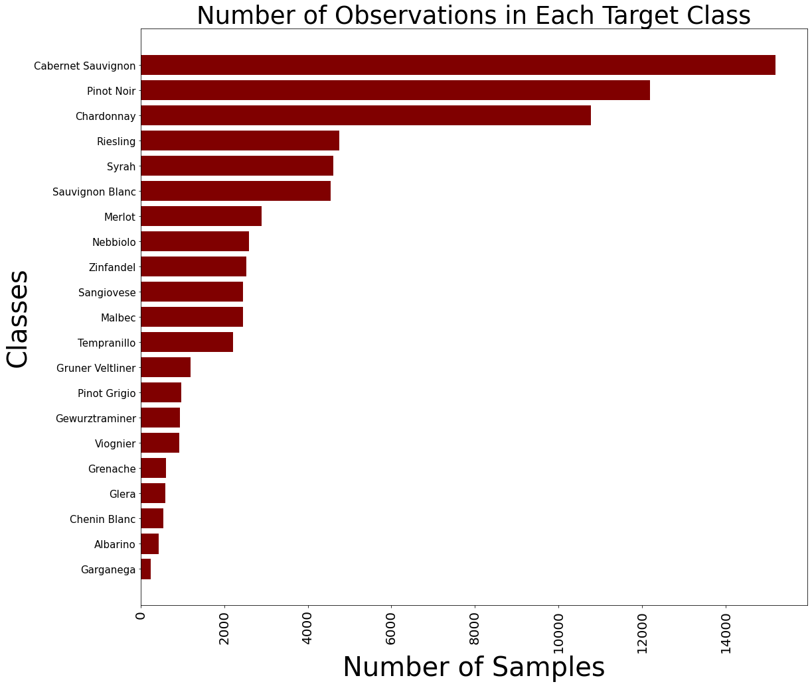
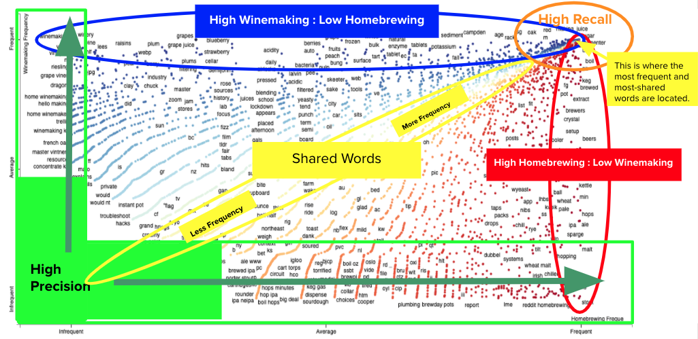
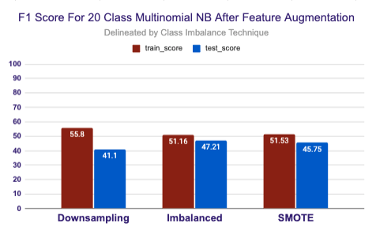
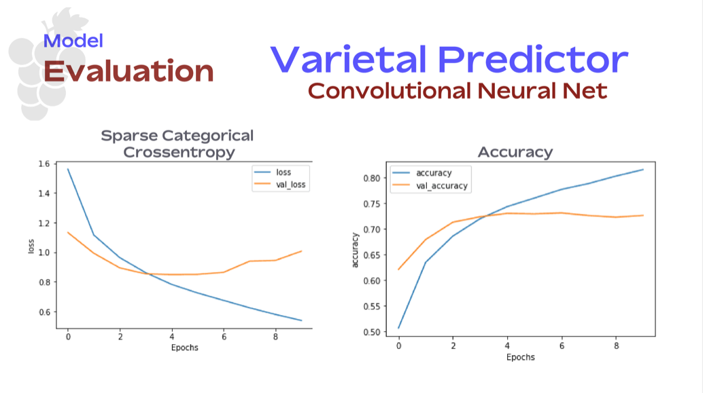

# Executive Summary

[intro](./05_presentation_media/intro_pic.png)

## PROBLEM STATEMENT

People love to taste wine. To some it is part of their career, people actually get paid for it. To others it is for amusement and joy.  You may have seen the documentary Somm on Netflix. There you see a group of people attempting to become Master sommeliers by rigorously training themselves on geography, geology, winemaking processes and by drinking tons of wine. In that documentary a common training tool is highlighted. It is often called The 'Blind Taste.' and tasting wine in this fashion is both a training tool and a past-time for professionals and amateurs alike. 

In the blind tasting process you are given a glass or glasses of wine of which you know nothing about. You are then asked to taste them to determine what varietal or varietals the wine is made from, how old the wine is and from what region the wine was sourced and created. You can get quite good at accurately predicting many of these factors regularly If you do this many times and work hard toward getting better at it.

### The Relevance and Benefit of Wine Tasting

Many of you may have heard of the wonderful benefits of drinking wine. Such as the organic compound resveratrol which helps to limit stress and damage to DNA, or that low levels of wine consumption can actually clear away toxins from the brain and lower inflammation. [1] The physiological benefits are just one aspect of the benefits one would receive from consuming a nice glass of Napa Cab with their dinner. Gordon Shepherd, a Neuroscientist at Yale, detailed in a 2017 study that wine triggers nearly all of our senses in a way that can keep us mentally sharp. Wine tasting is so successful at this in fact, that he even suggests that it engages more of the brain than any other human behavior! “Solving a tough math problem, listening to music, and trying to hit a curveball each stimulate the brain less than drinking a glass of wine.” [1] Another study conducted by University College of London researchers found that all moderate wine drinkers, especially women, performed better than nondrinkers on exams that tested brain power. [2] 
 
So it is clear that wine can possibly promote your health and cognitive form. However, wine tasting not only benefits your health and mental agility it is also fun. It is a social experience. You can do it alone, but it is most enjoyed with other people and in invigorating settings that harden your synapses to the memories around it. It is also very much a game. As a species we humans love to spend our social time strategizing and competing. Whether it is sports, darts, cards against humanity, monopoly or video games, we are always seeking stimulating environments that are competitive, enriching and social. 

It is also very rewarding when you are actually able to succeed in a blind tasting. One of my most memorable moments was in a somm certification class. The Master Somms instructing the class were randomly calling on people to blind taste wines. I was selected and stood up in front of hundreds of people and successfully predicted the varietal (which was Tempranillo), the age (about 8 years old) and the region (Rioja) in which the wine came from. As both a mental and physical endeavor, it can be a truly gratifying experience when you are able to predict something that could be one of hundreds or thousands of possibilities. 

This game, the enjoyment of it, and many mental and physiological health benefits are the reason I am undertaking this project. People who love wine and new wine drinkers often play this game at home. It is a good way to train your palette. It gets you thinking about your senses and in particular your senses of taste and smell. You start to think about the grape growing process, the vinification process and the raw materials that go into making the wine. It is truly an exercise for the mind. There is a strong demand for wine tasting games and kits on the market already. Many of them come in the form of board games and flash cards but there exists no truly interactive tool to gamify the wine tasting experience in a digital setting. 

Because of this digital void in the market for digitized wine tasting simulation I have developed a prototype for a multi-class prediction model and will explore the efficacy of gamifying wine varietal prediction. 

### Addressable Market

The target market for this type of an app is two-sided. On the consumer side I envision the many consumers that enjoy wine regularly or are interested in enjoying and improving their wine tasting abilities to find an app like this to be rewarding. They will go through a series of questions that will ask them to describe the wine they are tasting, then submit those descriptions to the model and it will return a prediction. If they were successful at describing the wine the app will, in theory, return the right varietal. If they were unsuccessful it will return the wrong varietal and give them information regarding their description choices and how it impacted the predictor. 

The app will also collect information about their descriptors and save it as a tasting note along with a self-reported rating score so they can access this information later. The app may additionally be able to feed this information into recommender models that may offer wines that they may enjoy. 

Another target vertical for this type of project would be on the business side of wine distribution. I envision large wine distributors gaining value from this. These large wine sellers and producers can leverage the data that an app like this would collect.   They could develop recommender models that suggest their wines or use the app as a marketing tool by putting a QR code on a variety of bottles of wine and advertising them as compatible with the app or offering free download of the app with the purchase of a bottle of wine. This is not an exhaustive list of the potential uses of this app in industry but it does highlight some very likely use cases for an app of this nature. 

### Measuring Success of Project

The goal in determining efficacy for further exploration of this topic will be to first prepare models that perform better than a random baseline model and then to prepare models that perform better than the average person would perform when predicting varietal. The average person’s performance would be based on the project author ‘s perception of how the average person would perform based on the author’s own domain knowledge. 

The scoring of this project will be based initially on macro F1-Score, which is the harmonic mean between precision and recall. Other measures will also be used to highlight effectiveness. F1 Score essentially combines precision and recall into a single metric and gives much more weight to low values. As a result it will only be high if both recall and precision are high. Precision is the measure of correct predictions among all observations that were predicted positive and Recall is the ratio of actually positive instances that are correctly predicted to be positive. With this score we are more able, in a classification problem, to determine whether our model is getting positive predictions correct and accounting for all positive values accurately. 

However, in multi-class classification and particularly with problems that contain imbalanced classes it can be helpful to use a probability classification metric instead of a score. I will also explore target probability metrics like PR AUC. 

__________
# THE DATA
_______

The data for this prototype was created by Zack Thoutt a full-stack engineer from Boulder, CO. It is housed on Kaggle and can be found at this link. 

[Wine Review Data Set]('https://www.kaggle.com/zynicide/wine-reviews/home')

The data was scraped from Wine Enthusiast Magazine at winemag.com during the week of June 15th, 2017. It was then scraped again on November, 22nd, 2017 to update observations and add a ‘Title’ feature. The entire dataset that was used in this project was 130,000 observations. Although preliminary data analysis and exploration was done on many of the features for informational purposes and the author’s own musings, the actual EDA, preprocessing and modeling for the prototype predictor focused only on the Varietal, Description, Color (Created by me), and Parsed (Created by me) features. The data dictionary is found below. 

#### Notable Feature Counts in Dataset
(Not all Features Included)

|Count|Feature|
|---|---|
|708|Unique Grape Varietals|
|16,755|Unique Wineries|
|1230|Regions|
|46|Countries|

______
## THE TARGET VARIABLE
______

This project will develop  ‘Varietal’ feature classifier models to predict varietal class based on the ‘Description’ feature which will be parsed and vectorized.  For exploratory purposes there will be one model that predicts the ‘Color’ feature but it is not an integral part of the project. Of the 708 unique varietals in the dataset I picked out 10 white varietals and 10 red varietals. I selected these classes with a combination of analyzing the largest value counts and using domain expertise to make some changes to the counts list. 

_____
## Imbalanced Classes
______

The data for this multiclass classification problem was severly imbalanced with observation counts ranging from just over 200 values for the lowest class to over 14,000 values in the largest class. Below are the methods used to remediate class imbalance.

**Include Imbalanced Class Chart**

### Undersampling

I created a custom function that takes in a dataframe, the target column label and a number `n` and outputs a downsampled dataframe with all classes having value counts of `n` observations if that class is greater than `n` observations. 

### SMOTE Bootstrapping

**Synthetic Minority Oversampling Technique** is a statistical technique that increases the number of observations in a dataset. It does this in a balanced way by generating new synthetic observations from existing minority cases supplied as imput. Majority observation counts will not be manipulated. 

**How it Works**

The new observations are synthetically created and not copied. "Instead the algorithm takes samples of the feature space for each target class and its neighbors, generates new examples that combine features of the target case with features of its neighbors. This approach increases the features available to each class and makes the samples more general." [3]

**Example**

SMOTE takes the entire dataset as an input, but it increases the percentage of only the minority cases. For example, suppose you have an imbalanced dataset where just 1% of the cases have the target value A (the minority class), and 99% of the cases have the value B. To increase the percentage of minority cases to twice the previous percentage, you would enter 200 for SMOTE percentage in the module's properties." [3]

### Data Dictionary
______

|Feature Name|Description| 
|---|---|
|varietal| The variety of grape used to make the wine (i.e. Cabernet Sauvignon).|
|country|The country where the wine was produced.|
|description| A sommelier's brief note including key flavor, texture and structural descriptors.|
|designation|A single vineyard name or "fantasy" label name.|
|points|WineEnthusiast wine rating scale 1-100.|
|price|The price to purchase a bottle of wine in U.S. dollars.|
|province|The name or province where the wine was produced.|
|region_1|A primary wine region name such as Napa or Bordeaux|
|region_2|A secondary wine region name likely smaller than region_1 such as Oakville or Serralunga D'alba.|
|taster name|The name of the sommelier providing description.|
|taster_twitter_handle| The twitter handle of the sommelier providing description.|
|title|The title of the wine review (Also may include vintage and other naming characteristics of the wine).|
|color|The color of the wine. Either 'red' or 'white'|

#### Features Created In This Project

|Feature Name|Description|
|---|---|
|parsed|A version of the description column with spaCy embeddings applied|
|parsed_w_stops|A version of the description column with spaCy embeddings and stop words applied|

_____
### Feature Importance and Analysis
_____

#### Scattertext

Scattertext creates a visualizaton for comparing the importance scores of bag-of-words features to univariate metrics. 

**Note on Class Imbalance Regarding Scattertext** The scoring metrics within Scattertext assume perfect class symmetry. Therefore, it you have an imbalanced dataset I recommend downsampling prior to performing Scattertext Analysis. This will also make your dataset more lightweight and improve speed of render. 

**Term Frequencies**

Term frequencies are word and phrase frequencies. Two-word n-grams are included in Scattertext if you choose. The y-axis represents the term frequencies for one class whereas the x-axis represents the term frequencies for the opposite class. Term frequencies are important in knowing which features are represented most in your models and is also good for analyzing stop-word removals as the terms most often located in both classes are usually good candidates for removal from the corpus. 

**Scaled F1 Scores**

The score is on a scale of -1 to 1. Scores that are near zero have word frequencies that are similar for both classes (these are the yellow and orange dots). Scores that are near 1 will have word frequencies dominated by the positive class (in blue). Scores that are near -1 will have word frequencies dominated by the negative class (in red). The darker the color of red or blue indicates the closer the score is to -1 or 1. **Scores of -1 or 1 will have more predictive power**

**Feature Recall**

The frequency a word appears in a particular class. The variance of precision tends to decrease as recall incrases. 

**Feature Precision**

Precision is a terms ability to discriminate regardless of a term's frequency. A term that only appears once in the corpus, for instance, will have perfect precision since it will only always be represented by one class. Words close to the X and y-axis have high precision for the respective classes represented on each axis. 

**Scattertext Interpretation**

* Image created by me. 

_____
## MODEL PERFORMANCE
______

### Baseline for 21 class multi-classification model

| Baseline for Balanced Classes|Baseline For Imbalanced Classes (Range)|
|---|---|
|4.76%|.3% to 20.6%|

____
### Multinomial Naive Bayes Performance Summary

The following charts detail the performance of Multinomial Bayes Classifier on 21 class multi-classification of grape varietals. The first chart is the performance of the algorithm after preprocessing and the second chart details the performance of the algorithm after preprocessing and feature augmentation. The model performed above baseline but to recreate a successful blind tasting experience I would need better performance. 
_________

 

 

____
### Convolutional Neural Net Summary
_____

The following charts detail the performance of Convolutional Neural Net on 21 class multi-classification of grape varietals. This chart details the performance of the algorithm after preprocessing and feature augmentation. The model performed well above baseline accuracy but to recreate a successful blind tasting experience I would need slightly better performance. 

The top chart is the details the loss based on a Sparse Categorical Crossentropy loss function. Convergence between the 2 is at around 3 epochs. Converging at the epoch is the accuracy score, found in the second chart. It score ~73 percent accuracy score in the 3rd epoch where accuracy and validation accuracy met. 
_________

 

### Model Production Summary

At this point this project is not quite ready to go to production. More data and industrial grade nlp processing and modeling will get it there. 

 
## Primary findings/conclusions/recommendations

Is it possible to create a wine varietal predictor model for the purpose of training people to get better at blind tasting and wine description. In short, yes. I found these preliminary results to be promising. The models performed far better than the baseline and similar to how one would expect an ordinary and average person to perform in similar circumstances. 

That being said, there is still tremendous room for improvement. I feel that with more compute power, more data, and industrial grade NLP methods a model of this nature could achieve the standards necessary to help people enjoy training their palattes with a digital tool. 

____
## Next steps
_____

**Different Modeling Techniques**
* Recurrent Neural Nets
* Cost Sensitive Learning Techniques [4], [5] 
* One-Class Algorithms
* Probability Tuning Algorithms
* One Verse Rest/One Verse All
* One Verse All

**Feature Importance and Augmentation**
* Implementing Class Weighting via SciKitLearn's `compute_class_weight()` function. [6]

**Other Things I would like to do**
* Finish deploying to Streamlit
* Predict region and vintage
* Create a wine buyers guide from the initial EDA

TTD
* Clean up the classifier name column in the grid search in 21_multi_df

_____
## Outside Research
_____

[1] [Drinking Wine Helps Your Brain in an Unexpected Way, According to Yale Neuroscientist]('https://www.inc.com/scott-mautz/drinking-wine-helps-your-brain-in-an-unexpected-way-according-to-yale-neuroscience.html#:~:text=It%20all%20started%20in%202017,drinking%20a%20glass%20of%20wine')

[2] [Thinking About a Glass of Wine? New Study Finds Moderate Drinkers May Have Superior Cognitive Skills ]('https://www.winespectator.com/articles/thinking-about-a-glass-of-wine-new-study-finds-moderate-drinkers-may-have-superior-cognitive-skills-3399')

[3] [SMOTE Training Module from Microsoft Azure]('https://docs.microsoft.com/en-us/azure/machine-learning/studio-module-reference/smote#:~:text=SMOTE%20stands%20for%20Synthetic%20Minority,dataset%20in%20a%20balanced%20way.&text=SMOTE%20takes%20the%20entire%20dataset,of%20only%20the%20minority%20cases')

[Which Country Drinks The Most Wine]('https://vino-joy.com/2019/07/18/which-country-drinks-the-most-wine/')

[The 100 Point Wine Rating Scale]('https://www.gotastewine.com/articles/wine-rating-scale.htm')

[Wines Biggest Health Benefits, Drinking with Friends]('https://www.winespectator.com/articles/wine-s-biggest-health-benefit-might-be-drinking-with-friends')

[Wine stimulates the brain more than any other thing]('https://www.inc.com/scott-mautz/drinking-wine-helps-your-brain-in-an-unexpected-way-according-to-yale-neuroscience.html#:~:text=It%20all%20started%20in%202017,drinking%20a%20glass%20of%20wine')

[4] [Cost Sensitive Learning For Imbalanced Classification]('https://machinelearningmastery.com/cost-sensitive-learning-for-imbalanced-classification/')

[5] [The Foundations for Cost Sensitive Learning]('https://dl.acm.org/doi/10.5555/1642194.1642224')

[6] [Implementing Class Weights with Logistic Regression in SkLearn]('https://machinelearningmastery.com/cost-sensitive-logistic-regression/')

_____
# APPENDIX
_____

______
**Interpretation of Distribution of Rating "Point" Scores Plot**

* The official wine scale is a 50 point scale with 80 points marking the beginning of wines that are considered good. **The scale for this dataset starts at 80.**

| Rating | Meaning |
|---|---|
|50 to 59| Poor: undrinkable wine, not recommended|
|60 to 69| Below Average: drinkable wine but not recommended|
|70 to 79| Average: drinkable wine that may have minor flaws|
|80 to 84| Good: a solid, well-made wine|
|85 to 89| Very Good: wine with special qualities|
|90 to 94| Outstanding: wine with superior character and style|
|95 to 100| Classic: an all time great wine|

* You can see that none of the wines in the sample are of low quality. They all score Good or better. 
* The average rating is centered around 88-89 points with the mean, mode and medium all between 88-89 points. A little less than 5 percent of wines score less than 85 points so it is somewhat rare to find a very poor scoring wine in this sample. It is even more rare to find a great wine in this sample. Only around 2 percent of wines score over 94 points and achieved a 'Classic' rating. In light if this, it seems to be pretty difficult not to score Very Good or better on a rating. 
______

